# Presentación de defensa - Golf Swing Tracker

**Trabajo Final de Grado:** Diseño e implementación de un sistema automatizado de captura de golpes en golf mediante visión por computador y arquitectura distribuida.  
**Autor:** Aníbal Bayas Galindo  
**Enfoque de la defensa:** proceso de ingeniería de software: dominio, requisitos, análisis, diseño, arquitectura, datos, vistas e implementación.

---

## Índice de la presentación

1. [Planteamiento del problema](#1-planteamiento-del-problema)
2. [Solución propuesta](#2-solución-propuesta)
3. [Modelo del dominio](#3-modelo-del-dominio)
4. [Requisitos del sistema](#4-requisitos-del-sistema)
5. [Casos de uso](#5-casos-de-uso)
6. [Diagrama de contexto global](#6-diagrama-de-contexto-global)
7. [Flujo de actividad principal](#7-flujo-de-actividad-principal)
8. [Diagramas de secuencia](#8-diagramas-de-secuencia)
9. [Modelo MVC de análisis](#9-modelo-mvc-de-análisis)
10. [Prototipos de vistas](#10-prototipos-de-vistas)
11. [Arquitectura del sistema](#11-arquitectura-del-sistema)
12. [Modelo lógico de datos](#12-modelo-lógico-de-datos)
13. [Modelo de despliegue](#13-modelo-de-despliegue)
14. [Organización del código](#14-organización-del-código)
15. [Trazabilidad entre requisitos, diseño e implementación](#15-trazabilidad-entre-requisitos-diseño-e-implementación)
16. [Validación y cierre](#16-validación-y-cierre)

---

## 1. Planteamiento del problema

El punto de partida del proyecto es una limitación habitual en la práctica del golf: el registro de golpes depende normalmente de una grabación manual, de la colocación previa de un dispositivo o de la ayuda de otra persona. Esto provoca tres problemas principales:

| Problema detectado | Consecuencia en el usuario | Necesidad de ingeniería |
|---|---|---|
| Grabación manual | El jugador interrumpe la práctica | Automatizar la captura |
| Un único punto de vista | Información visual incompleta | Incorporar varias cámaras |
| Falta de asociación contextual | El vídeo no queda vinculado al hoyo o usuario | Gestionar sesiones, usuarios y clips |

El objetivo no es solo construir una aplicación, sino diseñar un sistema completo capaz de transformar un evento deportivo real en información digital persistente, consultable y trazable.

---

## 2. Solución propuesta

La solución propuesta es un sistema automatizado de captura de golpes de golf mediante cámaras fijas, visión por computador, backend y aplicación móvil.

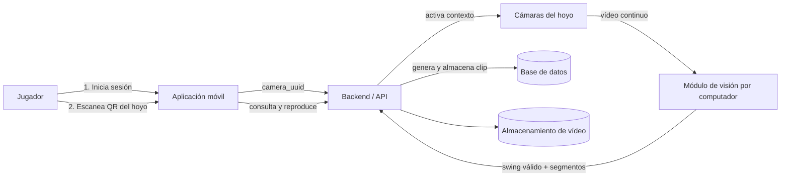

La solución se apoya en cuatro ideas principales:

| Decisión | Función dentro del sistema |
|---|---|
| Activación mediante QR | Relaciona usuario, campo, hoyo y cámaras |
| Visión por computador | Detecta el swing y valida el evento deportivo |
| Backend centralizado | Gestiona usuarios, sesiones, clips, permisos y estadísticas |
| Aplicación móvil | Permite activar el sistema, consultar clips y gestionar favoritos |

---

## 3. Modelo del dominio

El modelo del dominio representa los conceptos reales del problema antes de entrar en detalles técnicos. Es la base para los requisitos, los casos de uso, el modelo de datos y el diseño posterior.

### 3.1 Conceptos principales

| Concepto | Significado en el dominio |
|---|---|
| Usuario | Persona que utiliza el sistema. Puede actuar como jugador o administrador. |
| Jugador | Usuario que activa la captura y consulta sus clips. |
| Administrador | Usuario con permisos de supervisión sobre clips, usuarios y estadísticas. |
| Campo | Instalación deportiva donde se ubican los hoyos. |
| Hoyo | Unidad de juego dentro de un campo. Contextualiza cada captura. |
| Cámara | Dispositivo físico asociado a un hoyo y con un rol concreto. |
| Código QR | Identificador visual que permite activar el contexto de captura. |
| Sesión de captura | Intervalo en el que un usuario queda asociado a un hoyo y a sus cámaras. |
| Evento detectado | Swing o acción candidata detectada por el sistema. |
| Clip | Vídeo generado tras validar el evento y procesar los segmentos. |
| Estadística | Información derivada de clips, usuarios, hoyos y favoritos. |

### 3.2 Diagrama de clases del dominio

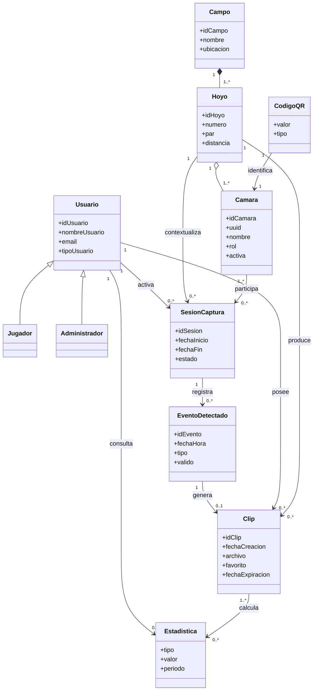

### 3.3 Idea clave del dominio

El sistema no se limita a guardar vídeos. El modelo del dominio mantiene la trazabilidad completa:

```text
Usuario -> Sesión de captura -> Evento detectado -> Clip generado -> Consulta posterior
                 |
              Campo / Hoyo / Cámaras
```

---

## 4. Requisitos del sistema

Los requisitos se agrupan según la responsabilidad funcional que cumplen dentro del sistema.

### 4.1 Requisitos funcionales agrupados

| Grupo | Requisitos | Finalidad |
|---|---|---|
| Identificación y contexto | RF-01 a RF-04 | Autenticar al usuario y activar el contexto del hoyo mediante QR. |
| Detección del evento | RF-05 a RF-07 | Detectar el swing válido diferenciándolo de movimientos previos. |
| Generación del clip | RF-08 a RF-11 | Crear, procesar y almacenar el vídeo asociado al golpe. |
| Asociación y trazabilidad | RF-12 a RF-14 | Mantener relación entre usuario, sesión, evento, hoyo y clip. |
| Consulta y reproducción | RF-15 a RF-17 | Permitir al usuario acceder a sus clips disponibles. |
| Conservación y favoritos | RF-18 a RF-22 | Marcar favoritos y aplicar caducidad a clips no conservados. |
| Estadísticas y administración | RF-23 a RF-26 | Ofrecer estadísticas y funciones de gestión al administrador. |

### 4.2 Requisitos suplementarios

| Categoría | Decisión de diseño asociada |
|---|---|
| Rendimiento | Procesamiento de vídeo separado y generación de clips en formato reproducible. |
| Fiabilidad | Validación del swing mediante varias señales visuales y control de errores. |
| Seguridad | Autenticación, permisos y separación entre jugador y administrador. |
| Disponibilidad | Componentes diferenciados para captura, backend, almacenamiento y app móvil. |
| Mantenibilidad | Organización modular de IA, backend y aplicación móvil. |
| Portabilidad | Configuración mediante variables y separación entre lógica y entorno. |
| Usabilidad | Flujo simple: iniciar sesión, escanear QR, consultar clips. |

---

## 5. Casos de uso

Los casos de uso representan los servicios que el sistema ofrece a los actores. Todos parten de un actor externo, como exige el análisis de requisitos.

### 5.1 Diagrama de casos de uso

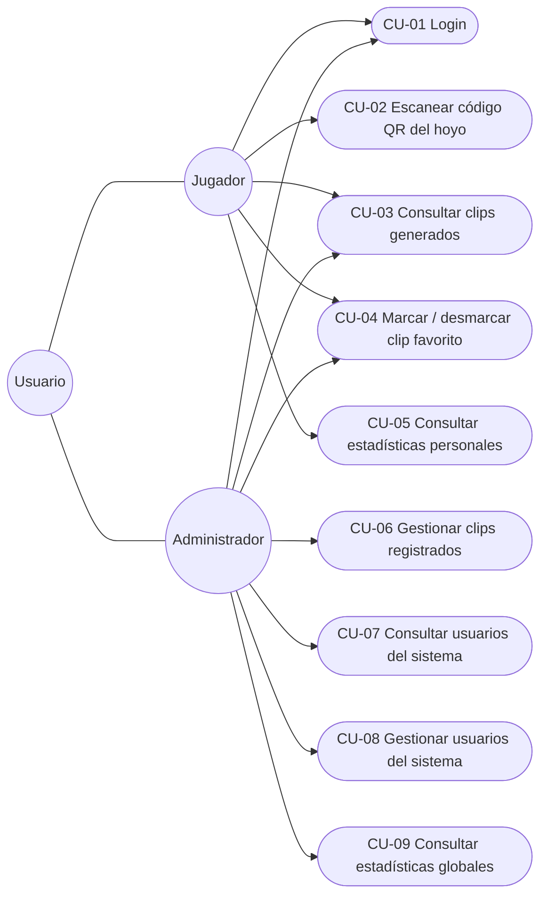

### 5.2 Priorización

| Código | Caso de uso | Actor principal | Prioridad |
|---|---|---|---|
| CU-01 | Login | Jugador / Administrador | Alta |
| CU-02 | Escanear código QR del hoyo | Jugador | Alta |
| CU-03 | Consultar clips generados | Jugador / Administrador | Alta |
| CU-04 | Marcar o desmarcar clip como favorito | Jugador / Administrador | Media |
| CU-05 | Consultar estadísticas personales | Jugador | Media |
| CU-06 | Gestionar clips registrados | Administrador | Media |
| CU-07 | Consultar usuarios del sistema | Administrador | Media |
| CU-08 | Gestionar usuarios del sistema | Administrador | Media |
| CU-09 | Consultar estadísticas globales del sistema | Administrador | Media |

---

## 6. Diagrama de contexto global

El contexto global muestra cómo el sistema cambia de estado a través de los casos de uso. No representa solo componentes, sino la evolución del sistema desde el acceso del usuario hasta la disponibilidad del clip.

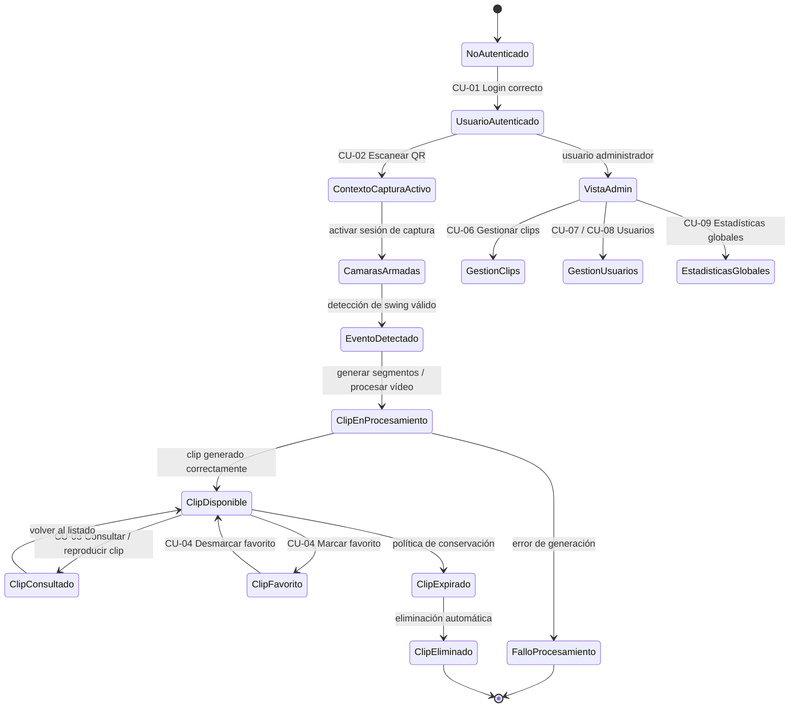

### Lectura del contexto

El flujo principal del jugador es:

```text
No autenticado -> Autenticado -> Contexto de captura -> Evento detectado -> Clip disponible -> Consulta
```

El flujo del administrador parte también del login, pero cambia hacia tareas de supervisión:

```text
Autenticado como administrador -> Clips / Usuarios / Estadísticas globales
```

---

## 7. Flujo de actividad principal

El flujo más importante del sistema es la activación mediante QR y la generación automática del clip.

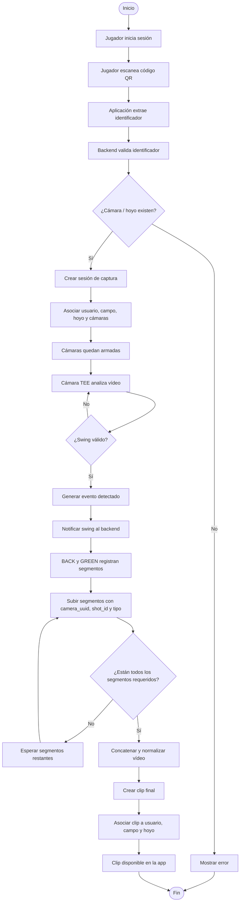

---

## 8. Diagramas de secuencia

### 8.1 CU-01 Login

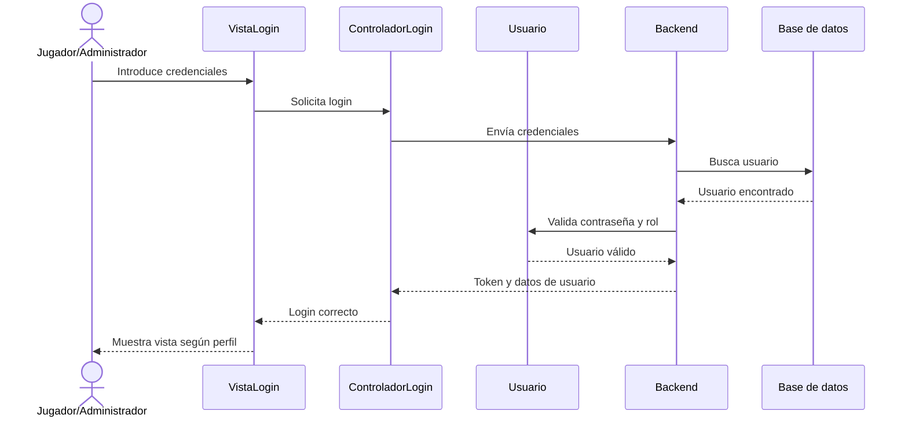

### 8.2 CU-02 Escanear código QR del hoyo

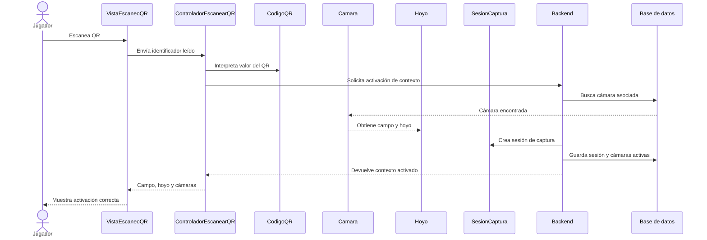

### 8.3 Generación automática de clip

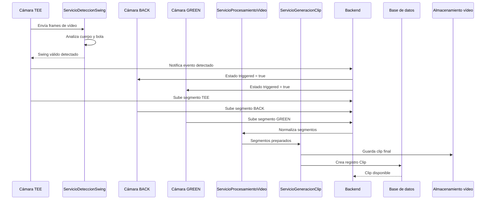

### 8.4 CU-03 Consultar y reproducir clips

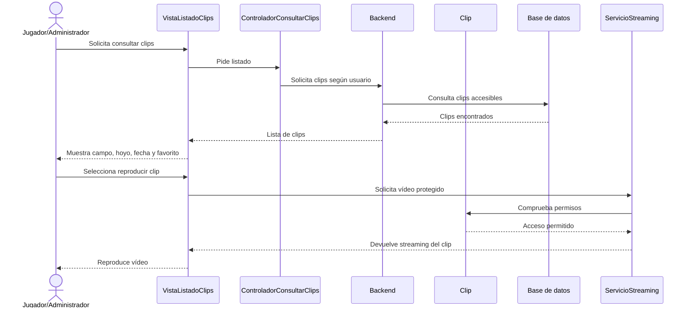

### 8.5 CU-04 Marcar / desmarcar favorito

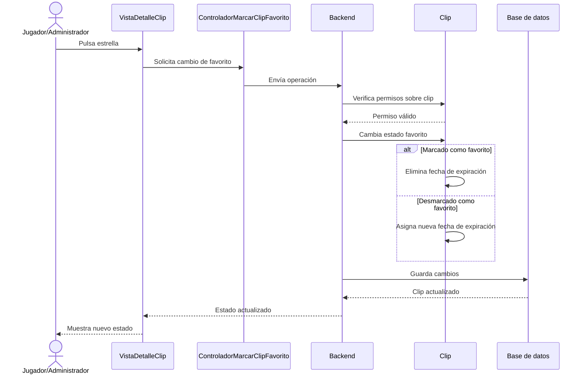

### 8.6 CU-09 Consultar estadísticas globales

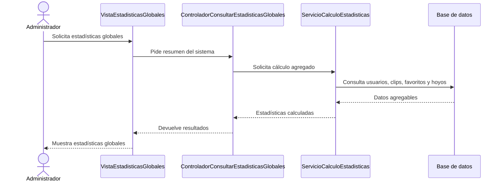

---

## 9. Modelo MVC de análisis

El diseño separa claramente las responsabilidades:

| Elemento MVC | Responsabilidad en análisis |
|---|---|
| Vista | Presenta información y recoge acciones del usuario. No contiene la lógica principal del caso de uso. |
| Controlador | Coordina el caso de uso. Valida, aplica permisos y decide qué modelo o servicio interviene. |
| Modelo | Representa información del dominio: Usuario, Campo, Hoyo, Cámara, Sesión, Evento y Clip. |

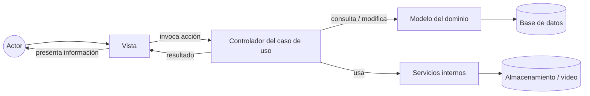

### 9.1 Tabla MVC por caso de uso

| Caso de uso | Vista asociada | Controlador | Modelo implicado |
|---|---|---|---|
| CU-01 Login | VistaLogin | ControladorLogin | Usuario |
| CU-02 Escanear QR | VistaEscaneoQR | ControladorEscanearQR | Usuario, CódigoQR, Cámara, Campo, Hoyo, SesionCaptura |
| CU-03 Consultar clips | VistaListadoClips / VistaDetalleClip | ControladorConsultarClips | Usuario, Clip, Hoyo, Campo |
| CU-04 Favorito | VistaDetalleClip | ControladorMarcarClipFavorito | Usuario, Clip |
| CU-05 Estadísticas personales | VistaEstadisticasPersonales | ControladorConsultarEstadisticasPersonales | Usuario, Clip |
| CU-06 Gestionar clips | VistaGestionClips | ControladorGestionarClipsRegistrados | Usuario, Clip |
| CU-07 Consultar usuarios | VistaUsuariosAdministrador | ControladorConsultarUsuariosSistema | Usuario |
| CU-08 Gestionar usuarios | VistaGestionUsuarios | ControladorGestionarUsuariosSistema | Usuario |
| CU-09 Estadísticas globales | VistaEstadisticasGlobales | ControladorConsultarEstadisticasGlobales | Usuario, Clip |

### 9.2 Servicios internos de diseño

| Servicio | Responsabilidad |
|---|---|
| ServicioDeteccionSwing | Analiza vídeo y detecta un swing válido. |
| ServicioProcesamientoVideo | Recorta, normaliza y prepara el vídeo. |
| ServicioGeneracionClip | Coordina la creación del clip final. |
| ServicioCalculoEstadisticas | Calcula estadísticas personales y globales. |
| ServicioEliminacionAutomatica | Elimina clips expirados no favoritos. |

---

## 10. Prototipos de vistas

Los prototipos permiten comprobar que cada caso de uso tiene una interfaz asociada y que la vista solo realiza tareas de presentación o invocación.

### 10.1 Vistas del jugador

| Vista | Caso de uso relacionado | Elementos principales |
|---|---|---|
| Inicio de sesión | CU-01 | Email, contraseña, botón de acceso |
| Pantalla principal | Navegación jugador | Acceso a QR, clips y estadísticas |
| Escaneo QR | CU-02 | Cámara móvil, área de escaneo, confirmación |
| Mis clips | CU-03 | Listado de clips, campo, hoyo, fecha, favorito |
| Detalle / reproducción | CU-03, CU-04 | Reproductor de vídeo, estrella de favorito |
| Estadísticas personales | CU-05 | Total de clips, favoritos, clips por hoyo |

### 10.2 Vistas del administrador

| Vista | Caso de uso relacionado | Elementos principales |
|---|---|---|
| Panel administrador | Entrada del perfil admin | Acceso a clips, usuarios y estadísticas |
| Clips registrados | CU-06 | Listado global, filtros, acciones de gestión |
| Usuarios del sistema | CU-07 | Lista de usuarios registrados |
| Gestión de usuario | CU-08 | Cambio de datos básicos y eliminación |
| Estadísticas globales | CU-09 | Totales, clips por mes, resumen por hoyo |

### 10.3 Mapa de navegación

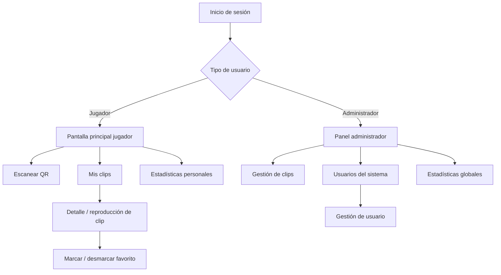

---

## 11. Arquitectura del sistema

El sistema se organiza en capas y subsistemas distribuidos.

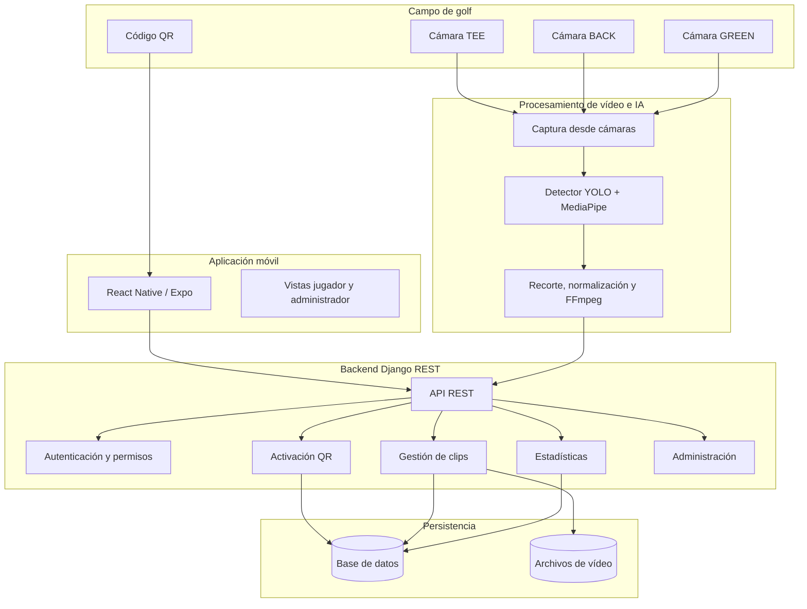

### 11.1 Responsabilidades por capa

| Capa | Responsabilidad |
|---|---|
| Captura | Recibir vídeo continuo desde cámaras físicas. |
| Procesamiento | Detectar el swing, generar segmentos y preparar vídeo final. |
| Backend | Coordinar usuarios, sesiones, cámaras, clips, permisos y estadísticas. |
| Persistencia | Guardar datos estructurados y referencias a vídeos. |
| Presentación | Ofrecer la interacción móvil al jugador y al administrador. |

---

## 12. Modelo lógico de datos

Este apartado sigue el modelo lógico explicado en el TFG. El prototipo puede simplificar físicamente algunas tablas, pero para la defensa del proceso de diseño se presenta el modelo lógico completo.

### 12.1 Entidades principales

| Entidad | Función |
|---|---|
| Usuario | Cuenta registrada en el sistema. |
| Campo | Campo de golf donde se instala el sistema. |
| Hoyo | Unidad de juego perteneciente a un campo. |
| Cámara | Cámara asociada a un hoyo y con rol TEE, BACK o GREEN. |
| CódigoQR | Identificador de activación del contexto de captura. |
| SesionCaptura | Activación de un usuario en un hoyo concreto. |
| EventoDetectado | Swing o evento validado durante una sesión. |
| Clip | Vídeo generado y asociado al usuario y hoyo. |
| Estadistica | Información derivada de clips y actividad del sistema. |

### 12.2 Diagrama entidad-relación lógico

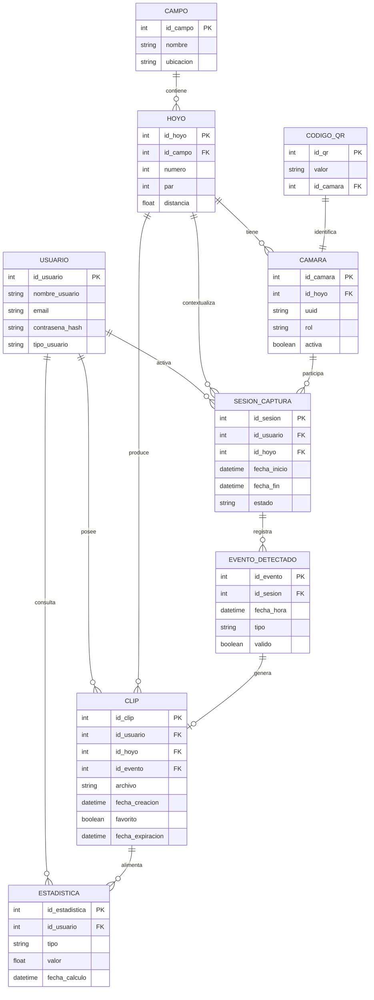

### 12.3 Reglas de datos importantes

| Regla | Justificación |
|---|---|
| Un campo contiene varios hoyos | Representa la estructura real del campo de golf. |
| Un hoyo puede tener varias cámaras | Permite captura multicámara. |
| Una sesión pertenece a un usuario y a un hoyo | Mantiene el contexto de captura. |
| Un evento puede generar cero o un clip | Solo los eventos válidos producen vídeo final. |
| Un clip pertenece a un usuario y a un hoyo | Permite consulta personal y trazabilidad. |
| Los clips no favoritos expiran | Evita crecimiento indefinido del almacenamiento. |
| Las estadísticas se derivan de clips y usuarios | No duplican información innecesaria. |

---

## 13. Modelo de despliegue

El despliegue refleja la distribución física y lógica de los componentes.

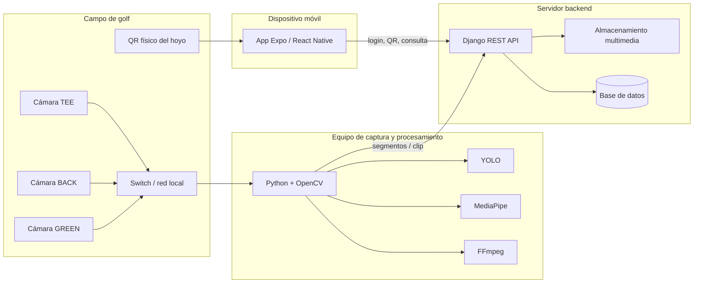

---

## 14. Organización del código

El repositorio se organiza por subsistemas, manteniendo separación entre IA, backend y aplicación móvil.

```text
Golf_proyect/
├── golf/                         # Módulo de visión por computador e IA
│   ├── src/
│   │   ├── swing_capture.py       # Punto de entrada del procesamiento
│   │   ├── config.py              # Configuración CLI / variables de entorno
│   │   ├── detector.py            # Detección de swing con YOLO + MediaPipe
│   │   ├── pipeline_live.py       # Flujo en vivo multicámara
│   │   ├── pipeline_backend.py    # Procesamiento offline de vídeos
│   │   ├── video_io.py            # Escritura y utilidades de vídeo
│   │   └── uploader.py            # Subida de segmentos al backend
│   └── runs/detect/train/weights/ # Pesos entrenados del modelo YOLO
│
├── golf_backend/                  # Backend Django REST
│   ├── clips/
│   │   ├── models.py              # Modelos Clip, Camera, QRSession, ShotEvent
│   │   ├── serializers.py         # Serialización de datos para API
│   │   ├── urls.py                # Rutas del módulo clips
│   │   └── views/
│   │       ├── qr.py              # Activación por QR y notificación de swing
│   │       ├── cameras.py         # Estado de cámaras
│   │       ├── upload.py          # Subida, reparación y composición de clips
│   │       ├── clips_list.py      # Consulta de clips
│   │       ├── clips_stream.py    # Streaming protegido de vídeo
│   │       ├── clips_admin.py     # Favoritos y administración de clips
│   │       └── clips_stats.py     # Estadísticas personales y globales
│   └── users/                     # Autenticación y gestión de usuarios
│
└── golf_mobile/                   # Aplicación móvil
    ├── screens/                   # Pantallas jugador y administrador
    ├── components/                # Componentes reutilizables
    ├── navigation/                # Navegación de la app
    └── utils/                     # API, configuración, JWT y subida
```

### 14.1 Correspondencia diseño - código

| Diseño | Implementación principal |
|---|---|
| VistaLogin | `golf_mobile/screens/LoginScreen.js` |
| VistaEscaneoQR | `golf_mobile/screens/ScanQrScreen.js` |
| VistaListadoClips | `golf_mobile/screens/HomeScreen.js`, `components/ClipCard.js` |
| VistaDetalleClip | `VideoPlayer.js`, componentes de clip |
| ControladorEscanearQR | `golf_backend/clips/views/qr.py` |
| ServicioDeteccionSwing | `golf/src/detector.py` |
| ServicioProcesamientoVideo | `golf/src/pipeline_live.py`, `pipeline_backend.py`, `video_io.py` |
| ServicioGeneracionClip | `golf_backend/clips/views/upload.py` |
| ServicioCalculoEstadisticas | `golf_backend/clips/views/clips_stats.py` |
| Streaming de clips | `golf_backend/clips/views/clips_stream.py` |

### 14.2 Flujo técnico implementado

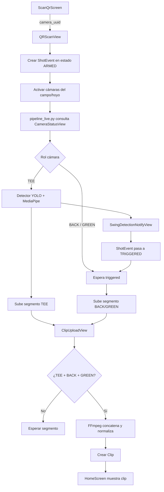

---

## 15. Trazabilidad entre requisitos, diseño e implementación

La trazabilidad permite demostrar que cada parte del diseño tiene relación con los requisitos y con el código final.

| Requisito / bloque | Caso de uso | Elemento de diseño | Implementación |
|---|---|---|---|
| RF-01 Identificar usuario | CU-01 Login | Usuario, ControladorLogin | Backend auth + app móvil login |
| RF-02 Activar por QR | CU-02 Escanear QR | CódigoQR, Cámara, SesionCaptura | `qr.py`, `CameraStatusView` |
| RF-03 Asociar usuario, campo y hoyo | CU-02 | Usuario, Campo, Hoyo, SesionCaptura | `QRScanView`, modelos de backend |
| RF-05 Detectar swing | Flujo de captura | ServicioDeteccionSwing | `detector.py`, `pipeline_live.py` |
| RF-07 Validar movimiento y bola | Flujo de captura | EventoDetectado | YOLO + MediaPipe |
| RF-08 Generar clip | Generación automática | ServicioProcesamientoVideo | `pipeline_live.py`, `upload.py` |
| RF-10 Formato compatible | Generación automática | ServicioProcesamientoVideo | FFmpeg H.264 / MP4 |
| RF-11 Asociar clip | CU-03 / generación | Clip | `ClipUploadView`, modelo Clip |
| RF-15 Consultar clips propios | CU-03 | ControladorConsultarClips | `clips_list.py` |
| RF-16 Reproducir clip | CU-03 | VistaDetalleClip, Clip | `clips_stream.py`, `VideoPlayer.js` |
| RF-18 / RF-19 Favoritos | CU-04 | Clip | `ClipFavoriteView` |
| RF-23 Estadísticas personales | CU-05 | ServicioCalculoEstadisticas | `clips_stats.py` |
| RF-24 Estadísticas globales | CU-09 | ServicioCalculoEstadisticas | `clips_stats.py` |
| RF-25 Gestión admin | CU-06, CU-07, CU-08 | Controladores admin | vistas admin + backend users/clips |

---

## 16. Validación y cierre

### 16.1 Qué se valida

| Aspecto validado | Resultado esperado |
|---|---|
| Login | El usuario accede con su perfil correspondiente. |
| Escaneo QR | El sistema identifica campo, hoyo y cámaras. |
| Activación de cámaras | Las cámaras quedan asociadas al usuario y al golpe activo. |
| Detección del swing | El sistema detecta un golpe válido y descarta movimientos no válidos. |
| Generación de clip | El clip se genera automáticamente tras el evento. |
| Asociación del clip | El vídeo queda asociado a usuario, campo y hoyo. |
| Consulta móvil | El usuario puede ver y reproducir sus clips. |
| Favoritos | Los clips favoritos se conservan y no expiran. |
| Administración | El administrador consulta clips, usuarios y estadísticas globales. |

### 16.2 Conclusión del proceso de ingeniería

El proyecto demuestra un proceso completo de ingeniería de software:

```text
Problema real
   -> Modelo del dominio
   -> Requisitos funcionales y suplementarios
   -> Casos de uso
   -> Análisis MVC
   -> Arquitectura distribuida
   -> Modelo lógico de datos
   -> Diseño de módulos
   -> Implementación
   -> Validación funcional
```

La contribución principal no es únicamente la aplicación final, sino la integración coherente entre análisis, diseño e implementación para automatizar la captura de golpes de golf mediante visión por computador y arquitectura distribuida.

---

## Resumen final de la defensa

El sistema parte de una necesidad clara: registrar golpes de golf sin intervención manual. Para resolverla se diseña un dominio basado en usuarios, campos, hoyos, cámaras, sesiones, eventos y clips. A partir de ese dominio se derivan requisitos, casos de uso y controladores MVC. La arquitectura separa aplicación móvil, backend, procesamiento de vídeo, cámaras y almacenamiento. Finalmente, la implementación materializa ese diseño en módulos diferenciados de IA, backend y app móvil, manteniendo trazabilidad entre lo especificado y lo construido.
